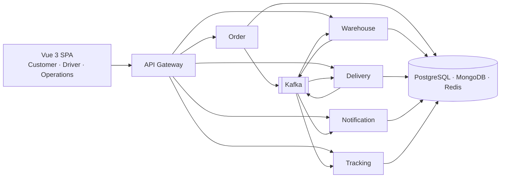
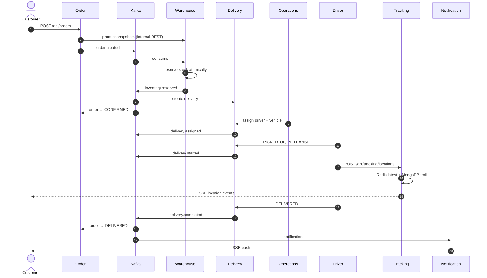
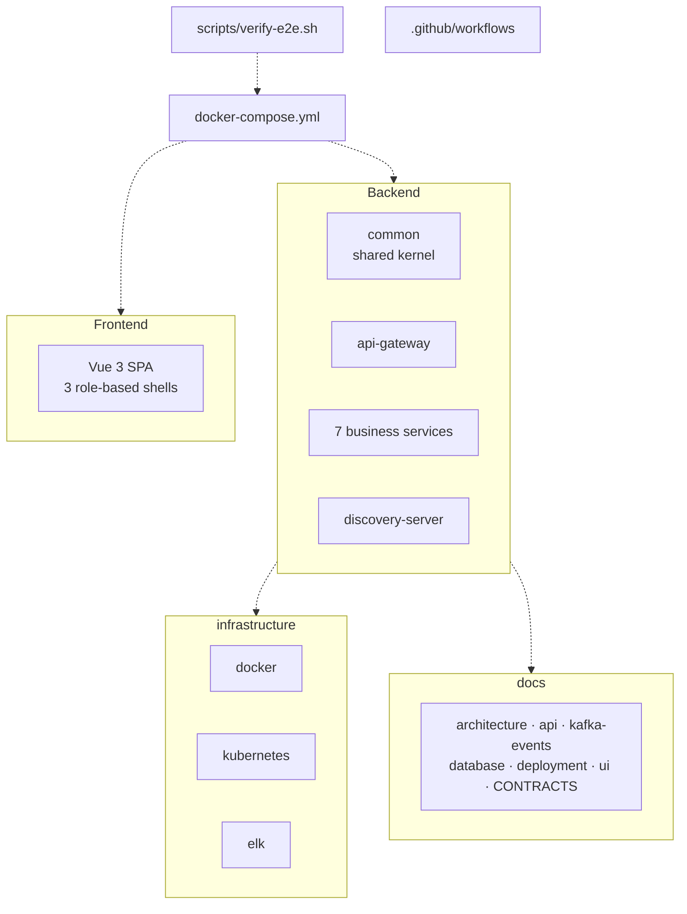

# FleetFlow

**Smart Logistics & Delivery Platform** — from warehouse to doorstep, every delivery in motion.

A production-shaped microservices platform built to demonstrate one complete business
flow end to end, rather than a collection of CRUD screens.



---

## The demo, in thirty seconds

```bash
cp .env.example .env
docker compose up --build
./scripts/verify-e2e.sh
```

Open **http://localhost:8088** and sign in as `customer1@fleetflow.local` /
`Password123!`.

The verification script walks the whole flow — registration, checkout, stock
reservation, delivery creation, assignment, driver progress, live tracking, completion
and notification — and prints a pass/fail line for each of its twenty-seven steps. It is
the acceptance test for this README's claims, and it runs against the real stack.

### What "verified" means here

Every claim below was checked against a running stack, not against a compile:

| Check | Result |
|---|---|
| `mvn -B install` (whole reactor, tests included) | BUILD SUCCESS — **264 tests, 0 failures** |
| `npm run lint` / `npm run typecheck` / `npm run build` | all exit 0 |
| `docker compose up --build` | 14 containers, all healthy |
| `./scripts/verify-e2e.sh` | **27/27**, exit 0, and re-runnable |
| `./scripts/verify-frontend.sh` | **9/9** — SPA served, `/api` proxied, auth enforced |

The last two scripts are part of the repository, not one-off commands.

### If a port is already taken

Compose reads every host port from `.env`, so moving the stack off a busy machine is a
matter of editing that one file (for example `GATEWAY_PORT=18080`). The defaults in
`.env.example` are the documented ones; container-to-container URLs are unaffected
because they use the compose network, not host ports.

### Watch it happen by hand

1. Sign in as **customer** (`customer1@fleetflow.local`) and place an order from
   `/customer/checkout`. Four steps: products, review, address, confirm. Payment is cash
   on delivery; there is no payment UI because there is no payment provider.
2. Sign in as **operations** (`operations@fleetflow.local`) in a private window. Open
   **Deliveries**, assign a driver and a vehicle. The order timeline advances on its own
   as events arrive.
3. Sign in as **driver** (`driver1@fleetflow.local`) on a phone-sized window. Open the
   assigned delivery and step it through *picked up* → *start delivery*.
4. Back in the customer window, open **Track delivery**. The Leaflet map follows the van
   over Server-Sent Events. The driver window has a **DEMO SIMULATION** panel that
   generates the positions — there is no GPS hardware in this project, and the interface
   says so plainly rather than pretending.
5. Complete the delivery from the driver screen. The order flips to **Delivered**, a
   notification arrives in the customer header without a page refresh, and the operations
   dashboard counters move.

---

## What is actually implemented

Everything below works against real infrastructure. There is no mocked layer anywhere in
the request path.

| | |
|---|---|
| **Auth** | Registration, login, BCrypt hashing, HS256 JWT, stateless sessions, role-based authorisation, method-level `@PreAuthorize`, ownership checks |
| **Orders** | Server-side pricing, product snapshots, status machine, history timeline, customer cancellation rules |
| **Inventory** | Atomic reservation, `available`/`reserved` split with database `CHECK` constraints, per-order-line idempotency, low-stock derivation |
| **Deliveries** | Full lifecycle with an enforced state machine, driver and vehicle allocation with conflict checks, free-on-completion |
| **Events** | Nine Kafka topics, a typed envelope with correlation id and event id, idempotent consumers, explicit partition counts |
| **Tracking** | Redis for the latest position, MongoDB for the trail with a TTL index, Server-Sent Events for live updates |
| **Notifications** | Event-driven, deduplicated by `eventId`, pushed over SSE, unread counts |
| **Observability** | Actuator health groups, correlation id through gateway → service → Kafka → logs, an ELK profile that makes the trace searchable |
| **Delivery** | Multi-stage Docker images, Compose with three profiles, Kubernetes manifests with probes and a read-only root filesystem, GitHub Actions CI |

---

## Architecture at a glance

Eight Spring Boot services behind a gateway. Each owns its data; nothing reads another
service's tables.

| Service | Port | Owns | Consumes → Produces |
|---|---|---|---|
| `api-gateway` | 8080 | Routing, JWT verification, CORS, correlation id | — |
| `auth-service` | 8081 | Users, credentials, tokens | — |
| `customer-service` | 8082 | Customer profiles | — |
| `order-service` | 8083 | Orders, items, status history | `inventory.*`, `delivery.*` → `order.created` |
| `warehouse-service` | 8084 | Products, warehouses, stock | `order.created` → `inventory.reserved`, `inventory.insufficient` |
| `delivery-service` | 8085 | Drivers, vehicles, deliveries | `inventory.reserved` → `delivery.*` |
| `tracking-service` | 8086 | Location history and live state | `delivery.*` → — |
| `notification-service` | 8087 | Notifications | `order.created`, `inventory.*`, `delivery.*` → — |
| `discovery-server` | 8761 | Optional Eureka registry (off by default) | — |

### The flow



### Why events rather than calls

The obvious design has the Order Service call the Warehouse Service synchronously. It
fails in a specific way: the order is already committed, so a warehouse outage leaves
customers with orders that silently never fulfil.

Publishing `order.created` makes reservation asynchronous and retryable. Kafka can be
down for a minute and the order still fulfils. Synchronous calls are kept only where an
event genuinely cannot answer the question — the price at checkout, and the contact
snapshot when a delivery is created.

### Design decisions worth arguing about

* **A shared kernel module.** Error contract, correlation id, JWT primitives, event
  schemas and consumer idempotency live in `fleetflow-common` and are auto-configured.
  Duplicating an error handler seven times would be the alternative.
* **HS256 JWT written by hand** on `javax.crypto.Mac` — about eighty lines, a fixed
  algorithm, no third-party trust surface, constant-time signature comparison.
* **Events as explicit JSON.** `KafkaDomainEventPublisher` serialises the envelope
  itself rather than using reflective Kafka serializers, so the bytes on the wire match
  `docs/kafka-events.md` and no trusted-package configuration is needed.
* **Consume-side idempotency** via `INSERT … ON CONFLICT DO NOTHING` on `eventId` — one
  atomic statement, no lock. The tracking service skips it deliberately: its consumers
  are upserts, so a replay is harmless.
* **SSE through `fetch`, not `EventSource`.** `EventSource` cannot set headers, and the
  usual workaround puts the access token in the query string, where it lands in every
  access log and proxy trace.
* **No Eureka by default.** The gateway routes by explicit URL. The registry exists
  behind a Compose profile for the discovery-based variant, because defaulting to it
  would add a process that must be healthy before anything else can start, in exchange
  for load balancing two replicas already provide.
* **One Postgres instance, six databases.** Ownership is enforced by role, not by
  instance. Stated as a limitation in the docs rather than glossed over.

---

## Technology

**Backend** Java 17 · Spring Boot 3.3.5 · Spring Web · Spring Security · Spring Data
JPA · Spring Kafka · Spring Cloud Gateway · Flyway · PostgreSQL · MongoDB · Redis ·
springdoc-openapi · Actuator · JUnit 5 · Mockito · Testcontainers

**Frontend** Vue 3.5 · TypeScript (strict) · Vite · Pinia · Vue Router · Tailwind CSS ·
Leaflet + OpenStreetMap · Axios · ESLint · vue-tsc

**Platform** Docker · Docker Compose · Kubernetes · GitHub Actions · ELK

---

## Repository layout



```text
fleetflow/
├── backend/
│   ├── common/              shared kernel: errors, correlation id, JWT, events, idempotency
│   ├── api-gateway/         routing, token verification, CORS, access log
│   ├── auth-service/        registration, login, JWT issuance
│   ├── customer-service/    customer profiles
│   ├── order-service/       orders, pricing, status machine
│   ├── warehouse-service/   catalogue, warehouses, inventory reservation
│   ├── delivery-service/    drivers, vehicles, delivery lifecycle
│   ├── tracking-service/    Redis latest, MongoDB history, SSE
│   ├── notification-service/ in-app notification centre
│   └── discovery-server/    optional Eureka registry
├── frontend/
│   └── src/
│       ├── components/      ui primitives, layout shells, map
│       ├── stores/          Pinia: business state
│       ├── services/        typed API layer, SSE client
│       ├── views/           admin · customer · driver · auth · shared
│       └── styles/          design tokens
├── infrastructure/
│   ├── docker/              multi-stage Dockerfiles, nginx, Postgres bootstrap
│   ├── kubernetes/          namespace, config, secrets, per-service manifests, ingress
│   └── elk/                 Logstash pipeline, Filebeat
├── scripts/
│   ├── verify-e2e.sh        the 27-step acceptance test
│   └── verify-frontend.sh   the browser path: SPA + gateway proxy + auth
├── docs/                    architecture, api, kafka-events, database, deployment, ui
├── docker-compose.yml
└── .github/workflows/       ci.yml, frontend.yml
```

---

## Documentation

| | |
|---|---|
| [architecture.md](docs/architecture.md) | Services, the end-to-end flow, cross-cutting concerns, limitations |
| [api.md](docs/api.md) | Every endpoint, who may call it, status codes, a worked example |
| [kafka-events.md](docs/kafka-events.md) | Envelope, topology, payloads, consumer obligations |
| [database.md](docs/database.md) | Conventions, entity diagram, indexes, Mongo and Redis shapes |
| [deployment.md](docs/deployment.md) | Local, Compose, Kubernetes, environment variables, CI |
| [ui.md](docs/ui.md) | Design system and the rules the interface is held to |
| [CONTRACTS.md](docs/CONTRACTS.md) | The internal contract every service implements against |

---

## Testing

```bash
# Backend: unit tests
mvn -f backend/pom.xml test -DexcludedGroups=integration

# Backend: integration tests (Testcontainers — pulls real Postgres, Kafka, Mongo)
mvn -f backend/pom.xml test -Dgroups=integration

# Frontend
cd frontend && npm run lint && npm run typecheck && npm run build

# The whole business flow against a running stack
./scripts/verify-e2e.sh

# The browser path: SPA served by nginx, /api proxied to the gateway
./scripts/verify-frontend.sh
```

`scripts/verify-e2e.sh` needs only `bash`, `curl` and `node` — node because the SPA
already requires it, so the test adds no dependency the project does not already have.
It cancels any in-flight deliveries before it starts, which is what makes it re-runnable
against a fixed set of demo data.

Unit tests cover the business rules, not the plumbing: a customer may only cancel before
delivery processing begins; a reservation that exceeds availability changes nothing and
reports every shortfall; a partial failure across several order lines rolls back
completely; an unavailable driver is refused; `DELIVERED -> IN_TRANSIT` is a 409; a
driver cannot touch another driver's delivery.

Integration tests use Testcontainers against real databases. One of them in
`fleetflow-common` is a deliberate regression guard: it boots a real Hibernate
`EntityManagerFactory` with `ddl-auto=validate` against the exact column types the
migrations write. A drift in the shared `TimestampedEntity` mapping would otherwise fail
seven services simultaneously at boot, in production, with an obscure message.

### What running the stack in anger actually found

Worth recording, because every one of these passed compilation and every unit test:

| Bug | Why no test caught it |
|---|---|
| `IdempotencyService` used `queryForObject("SELECT 1 …")` | `JdbcTemplate` throws on *zero* rows, so the **first** event any consumer saw blew up — which silently blocked the entire order→inventory→delivery→notification flow. |
| The reactive gateway could not load the shared auto-configuration | Spring introspects every `@Bean` signature while evaluating conditions, so a class holding servlet types died with `NoClassDefFoundError: jakarta/servlet/Filter`. Split into two auto-configurations. |
| The gateway's correlation-ID filter wrote read-only headers | CORS decorates the exchange *before* global filters run. Moved to a `WebFilter` ordered ahead of CORS. |
| A `RemoveRequestHeader` gateway default broke every routed request | Same read-only-headers cause, one layer down. |
| The gateway's 30s response timeout killed SSE with a 504 | Only visible mid-delivery, over an open stream. |
| `(:search is null or lower(col) like …)` bound a null `String` as `bytea` | Every *unfiltered* search 500'd, and the unit tests only exercised a populated filter. |
| `recordedAt` was never defaulted | The SSE broadcast NPE'd *after* the point was persisted — a 500 telling the driver their report was lost when it was not. |
| `POST /internal/api/customers` never existed, though auth-service called it from day one | Two services agreed on a contract in their own heads. Delivery creation then failed forever on a 404. |
| `kafka-topics.sh` is not on `PATH` in `apache/kafka:3.8.1` | The init loop spun forever on "command not found", which reads exactly like an unreachable broker. |

---

## Demo credentials

Documented deliberately: they exist so the project can be demonstrated. They are seeded
only when `SEED_ENABLED=true`, which should be `false` anywhere real.

| Role | Email | Password | Lands on |
|---|---|---|---|
| Admin | `admin@fleetflow.local` | `Password123!` | `/admin` |
| Operations | `operations@fleetflow.local` | `Password123!` | `/admin` |
| Driver | `driver1@fleetflow.local` … `driver5@fleetflow.local` | `Password123!` | `/driver` |
| Customer | `customer1@fleetflow.local` … `customer10@fleetflow.local` | `Password123!` | `/customer` |

The seed also creates 20 products, 2 warehouses, 10 customers, 5 drivers, 5 vehicles,
20 orders, 10 deliveries, notifications and location history — including three
deliberately low-stock products and one out of stock, so the low-stock badge is visible
without editing anything.

Driver and vehicle status in the seed is *derived* from which deliveries are open rather
than listed alongside them, so the demo data cannot drift into looking corrupt.

---

## Running the frontend without Docker

```bash
cd frontend
npm install
npm run dev     # http://localhost:5173, /api proxied to http://localhost:8080
```

`npm run build` produces a static bundle in `frontend/dist`, which nginx serves in the
containerised setup. The SPA never calls a service directly: everything goes through the
gateway, so the browser sees one origin in local development, in Docker and behind the
Kubernetes Ingress alike.

---

## Three interfaces, on purpose

The driver experience is deliberately not the desktop console with a smaller viewport.
It is bottom navigation, 56-pixel touch targets, high contrast for sunlight, and a
status indicator you can read at a glance between stops. The customer app is
cards-and-checkout. The operations console is dense tables and a full-width map.

They share a design system — one accent colour, 8-point spacing, 1px borders instead of
shadows, status shown as glyph **and** label so colour is never the only signal — and
nothing else. A designer would not build three applications; a working operations tool
with three audiences is a different problem from one audience with one application.

---

## Screenshots

The running application is the demonstration. The screens that matter:

| Screen | Route | What to look at |
|---|---|---|
| Operations dashboard | `/admin` | KPI cards from live endpoints, active deliveries, real-data chart |
| Order detail | `/admin/orders/:id` | Timeline built from the status history, staff actions gated |
| Inventory | `/admin/inventory` | Low stock visible immediately, filters, adjustment dialog |
| Live operations map | `/admin/tracking` | Full-width Leaflet map, delivery list, live positions |
| Customer checkout | `/customer/checkout` | Four explicit steps, cash on delivery |
| Customer tracking | `/customer/tracking/:id` | Live map over SSE, connection status, timeline |
| Driver delivery | `/driver/deliveries/:id` | Large status, one primary action, demo simulation |

---

## Known limitations

Named here rather than buried, because a project that hides them is worse than one that
states them.

* **No service discovery by default.** Explicit URLs; Eureka exists behind a profile.
* **Service-to-service auth is one shared secret** over `/internal/**`. mTLS or signed
  tokens is the real answer.
* **No geocoding.** Addresses are text, so the map cannot show a destination pin, and
  the demo simulation steps from the last known position rather than pretending to know
  the route.
* **One warehouse** serves the MVP. Zone-aware selection across many is the natural next
  step.
* **No schema registry.** Payload contracts live in shared code, so a breaking payload
  change needs consumers redeployed.
* **Compose and the Kubernetes manifests run single-replica datastores.** The Kubernetes
  storage declarations are commented out rather than implying durability the demo cannot
  deliver.
* **No payment integration.** Cash on delivery, stated as such.
* **CI builds and tests. It does not deploy** — there is no cluster to deploy to, and
  claiming otherwise would be dishonest.