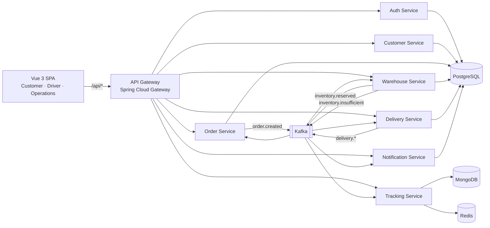
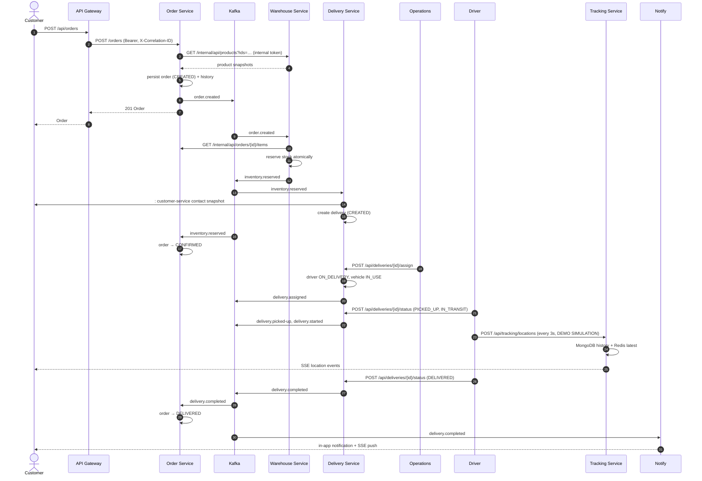
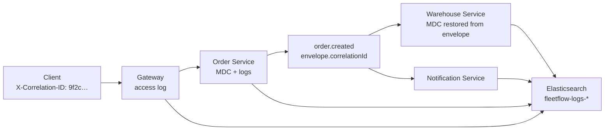
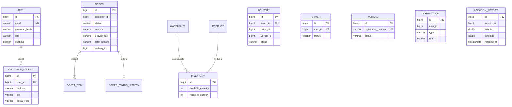
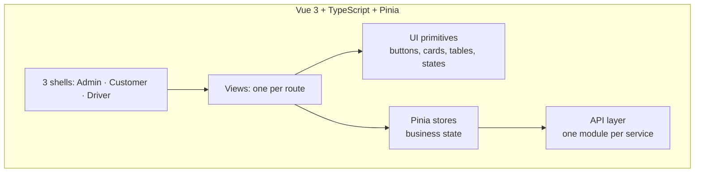

# FleetFlow Architecture

FleetFlow is a logistics platform built as eight Spring Boot microservices behind a
single gateway, connected by an event bus rather than by direct calls wherever the
data allows it.

The single sentence that describes the design: **a customer action becomes an event,
the event becomes work, and the work becomes an observable state change** — with the
same correlation id travelling the whole way.

---

## 1. Context



Every service owns its data. No service reads another service's tables.

---

## 2. Services

| Service | Port | Owns | Consumes | Publishes |
|---|---|---|---|---|
| `api-gateway` | 8080 | Routing, JWT verification, CORS, correlation id | — | — |
| `auth-service` | 8081 | Users, credentials, JWT issuance | — | — |
| `customer-service` | 8082 | Customer profiles | — | — |
| `order-service` | 8083 | Orders, items, status history | `inventory.*`, `delivery.*` | `order.created` |
| `warehouse-service` | 8084 | Products, warehouses, stock | `order.created` | `inventory.reserved`, `inventory.insufficient` |
| `delivery-service` | 8085 | Drivers, vehicles, deliveries | `inventory.reserved` | `delivery.assigned`, `delivery.picked-up`, `delivery.started`, `delivery.completed`, `delivery.failed`, `delivery.cancelled` |
| `tracking-service` | 8086 | Location history and live state | `delivery.*` | — |
| `notification-service` | 8087 | Notifications | `order.created`, `inventory.*`, `delivery.*` | — |

An optional `discovery-server` (Eureka, port 8761) exists behind a compose profile.
It is off by default because the gateway routes by explicit URL and a registry would
add a moving part without changing behaviour — see [§7](#7-service-discovery-optional).

---

## 3. Why events and not calls

The obvious design would have the Order Service call the Warehouse Service to reserve
stock synchronously. That fails in a specific, ugly way: the order is already committed,
and a warehouse outage would leave customers with orders that silently never fulfil.

Publishing `order.created` and reacting to it makes the reservation asynchronous and
retryable. The Warehouse Service can be down for a minute and Kafka will redeliver; the
order is still eventually fulfilled, and the failure is visible in the events rather
than swallowed in a timeout.

Synchronous calls are used only where an event cannot answer the question:

* **Order → Warehouse** at checkout, because the customer needs a price *now* to
  confirm the total. A price is a fact, not a notification.
* **Delivery → Customer** when a delivery is created, to snapshot the drop-off contact.
* **Auth → Customer** after registration, to pre-create the profile.
* **Notification → Order** is deliberately *not* a call: the events already carry
  everything needed to render a message.

Those four calls use `/internal/**` endpoints guarded by a shared secret. They are
absent from the gateway route table, so they are unreachable from outside the cluster.

---

## 4. The end-to-end flow



---

## 5. Cross-cutting concerns

### 5.1 Correlation id

One `X-Correlation-ID` header is created (or honoured) at the gateway, echoed on the
response, and written to the MDC by every service. It is carried inside every Kafka
event envelope and stamped onto the Kafka record header, so the same identifier
appears in the gateway access log, in each service that touched the request, and in
the events that request produced.



That is what makes the ELK demonstration worth having: one search in Kibana
(`correlationId: "9f2c…"`) returns the whole business flow.

### 5.2 Identity

`auth-service` issues a token whose subject is the platform-wide user id. That same
number is `orders.customer_id`, `notifications.user_id`, `customers.user_id` and
`drivers.user_id`.

Where a service has its own primary key for the same concept, both travel in the
event and they are never confused:

* `DeliveryAssignedPayload.driverId` — the Delivery Service's own driver key
* `DeliveryAssignedPayload.driverUserId` — the platform identity (the JWT subject)

Any authorisation check compares against `driverUserId`. Getting this wrong was a real
bug found during integration and is guarded by tests in both services.

### 5.3 Error contract

Every service answers with the same shape, and so does the gateway:

```json
{
  "timestamp": "2026-10-02T13:53:11.204Z",
  "status": 409,
  "error": "INVALID_STATE_TRANSITION",
  "message": "Delivery 12 cannot move from DELIVERED to IN_TRANSIT",
  "path": "/api/deliveries/12/status",
  "correlationId": "9f2c1a5e-…"
}
```

Implemented once in `fleetflow-common` as `GlobalExceptionHandler`; the gateway renders
the same shape for its own failures so the SPA has exactly one parser.

### 5.4 Idempotent consumers

Kafka guarantees at-least-once delivery. `IdempotencyService` writes each `eventId`
into a `processed_event` table with `INSERT … ON CONFLICT DO NOTHING` — one atomic
statement, no distributed lock — and skips anything already recorded. It is applied to
every handler in the order, warehouse, delivery and notification services.

The tracking service deliberately does **not** use it: its consumers are upserts keyed
on the delivery, so replaying an event is naturally harmless and a database round trip
per event would only add cost.

### 5.5 Schema management

Flyway owns every schema. `spring.jpa.hibernate.ddl-auto=validate` is the default, so a
mapping that drifts from a migration fails at boot rather than at 3am. A Testcontainers
test in `fleetflow-common` proves the shared `TimestampedEntity` mapping validates
against the `TIMESTAMPTZ` columns the migrations actually write.

---

## 6. Data ownership



Money is `NUMERIC(12,3)` throughout: the Tunisian dinar is quoted to three decimals, so
a two-decimal column would silently lose precision on unit prices.

---

## 7. Service discovery (optional)

Two supported modes, deliberately not mixed:

1. **Explicit URLs (default).** The gateway resolves each service from configuration.
   Works in `docker compose`, in Kubernetes (via Service DNS) and in a local IDE run
   with no extra process. This is what the project ships and what CI exercises.
2. **Eureka (`--profile discovery`).** Start `discovery-server`, register the services,
   and switch the gateway route URIs to `lb://service-name`.

The reason for not defaulting to discovery: it adds a process that must be healthy
before anything else can start, in exchange for load balancing that a two-replica
Deployment already provides.

---

## 8. Frontend



Three deliberate choices:

* **State lives in stores, not components.** Filters, pagination and fetched
  collections belong to a store, so a deep link, a refresh and a second screen all
  request the same slice.
* **Every view handles four states.** Loading, error, empty, loaded. `DataTable`
  enforces the first three so a screen cannot accidentally render "no results" while a
  request is still in flight.
* **Server-Sent Events through `fetch`, not `EventSource`.** `EventSource` cannot set
  headers, and the usual workaround — the token in the query string — writes the access
  token into every access log and proxy trace between the browser and the gateway.

The driver app is a different interface on purpose: bottom navigation, 56px touch
targets, high contrast, and a clearly labelled DEMO SIMULATION in place of GPS hardware.

---

## 9. Deployment

| Concern | Local | Docker Compose | Kubernetes |
|---|---|---|---|
| Entry point | Vite dev server :5173 | nginx :8088 → gateway :8080 | Ingress → gateway |
| Config | `application.yml` defaults | environment variables | ConfigMap + Secret |
| Secrets | local defaults | `.env` (git-ignored) | `secrets.yaml` placeholders, or External Secrets |
| Databases | one Postgres, six databases | same | StatefulSet, one database per service |
| Migrations | Flyway on boot | Flyway on boot | Flyway on boot |

Containers run as a non-root user with a read-only root filesystem and all Linux
capabilities dropped; the Kubernetes security context enforces the same. The CI image
job asserts the non-root user so a regression fails the pipeline.

Health probes use the actuator groups: readiness includes the datastores, liveness does
not. A database outage must stop new traffic without restarting every replica in the
namespace.

---

## 10. Deliberate limitations

Stated plainly, because a portfolio project that hides them is worse than one that
names them.

* **No service discovery by default.** See [§7](#7-service-discovery-optional).
* **No authentication between services beyond a shared secret.** The `/internal/**`
  endpoints use one static token; a real deployment would use mTLS or signed tokens.
* **Geocoding is absent.** Delivery addresses are text, so the map has no destination
  pin until coordinates are known. The driver simulation therefore steps from the last
  known position in a consistent direction.
* **Single-tenant, single-region.** One warehouse serves the MVP rather than a
  zone-aware selection across many.
* **The event bus has no schema registry.** Payload contracts live in code
  (`fleetflow-common`), so a breaking payload change requires redeploying consumers.
  Confluent Schema Registry is the natural next step.
* **One Postgres instance in compose and in the cluster.** Logical separation is real
  (a database and a role per service), physical isolation is not.