# FleetFlow Data Model

Six PostgreSQL databases, one MongoDB collection set, one Redis key space. A service
owns its data outright; nothing reads another service's tables.

---

## 1. Why six databases

A separate database per service is the smallest unit that actually enforces ownership.
Separate schemas in one database would be cheaper, but a service with a valid
connection string could still reach another service's tables, and "we agreed not to"
is not an access control.

For local development and for the Kubernetes manifests in this repository, all six run
in one PostgreSQL instance with one role each. Logical separation is real: a role has
no privileges on a database it does not own. Physical isolation is not, and
[architecture.md §10](architecture.md#10-deliberate-limitations) says so plainly.

```
postgres instance
├── fleetflow_auth           role fleetflow_auth
├── fleetflow_customer       role fleetflow_customer
├── fleetflow_order          role fleetflow_order
├── fleetflow_warehouse      role fleetflow_warehouse
├── fleetflow_delivery       role fleetflow_delivery
└── fleetflow_notification   role fleetflow_notification
```

---

## 2. Conventions

**Keys.** `BIGSERIAL` (`BIGINT GENERATED BY DEFAULT AS IDENTITY`) everywhere. Seed
data inserts explicit ids and then calls
`SELECT setval('<table>_id_seq', (SELECT MAX(id) FROM <table>))` so later inserts
continue from the right place.

**Timestamps.** `TIMESTAMPTZ NOT NULL`, mapped to `java.time.Instant`. Set by
`TimestampedEntity` in `@PrePersist`/`@PreUpdate` rather than by a database default, so
the Java and SQL views of a row never disagree. A Testcontainers test in
`fleetflow-common` proves this mapping validates under `ddl-auto=validate`.

**Money.** `NUMERIC(12,3)`. The Tunisian dinar is quoted to three decimals, so a
two-decimal column would silently round unit prices. `currency` is a `VARCHAR(3)`
defaulting to `TND`.

**Enums.** `VARCHAR` with a `CHECK` constraint, mapped with
`@Enumerated(EnumType.STRING)`. Ordinals are never persisted: reordering an enum would
otherwise silently corrupt data.

**Identity across services.** `auth-service` owns the user id. That same number is
`orders.customer_id`, `notifications.user_id`, `customers.user_id` and
`drivers.user_id`. Where a service needs its own key for the same concept, both travel
together and are documented — see `driverId` vs `driverUserId` in
[kafka-events.md](kafka-events.md).

**Migrations.** Flyway, one file per change, never edited after it has been applied.
`spring.jpa.hibernate.ddl-auto=validate` is the default, so a mapping that drifts from
a migration fails at boot.

---

## 3. Entity diagram

```mermaid
erDiagram
    AUTH_USER ||--o| CUSTOMER_PROFILE : "userId"
    AUTH_USER ||--o| DRIVER : "userId"

    AUTH_USER {
        bigint id PK
        varchar first_name
        varchar last_name
        varchar email UK "lower-cased"
        varchar phone
        varchar password_hash "BCrypt"
        varchar address
        varchar role "ADMIN|OPERATIONS|DRIVER|CUSTOMER"
        boolean enabled
        timestamptz created_at
        timestamptz updated_at
    }

    CUSTOMER_PROFILE {
        bigint id PK
        bigint user_id UK
        varchar first_name
        varchar last_name
        varchar email
        varchar phone
        varchar address
        varchar city
        varchar postal_code
        timestamptz created_at
        timestamptz updated_at
    }

    ORDER {
        bigint id PK
        bigint customer_id "auth user id"
        varchar status "7 states"
        numeric subtotal "12,3"
        numeric delivery_fee "12,3"
        numeric total_amount "12,3"
        varchar currency "TND"
        varchar delivery_address
        varchar city
        varchar postal_code
        bigint delivery_id "set on delivery.assigned"
        varchar cancelled_reason
        timestamptz created_at
        timestamptz updated_at
    }

    ORDER_ITEM {
        bigint id PK
        bigint order_id FK
        bigint product_id
        varchar product_name "snapshot"
        int quantity
        numeric unit_price "snapshot, 12,3"
        numeric line_subtotal "12,3"
        timestamptz created_at
        timestamptz updated_at
    }

    ORDER_STATUS_HISTORY {
        bigint id PK
        bigint order_id FK
        varchar status
        varchar previous_status
        varchar source "CUSTOMER|OPERATIONS|SYSTEM"
        varchar note
        timestamptz changed_at
    }

    WAREHOUSE {
        bigint id PK
        varchar name UK
        varchar address
        varchar city
        int capacity
        varchar status "ACTIVE|INACTIVE"
        timestamptz created_at
        timestamptz updated_at
    }

    PRODUCT {
        bigint id PK
        varchar sku UK
        varchar name
        varchar description
        varchar category
        numeric price "12,3"
        boolean active
        timestamptz created_at
        timestamptz updated_at
    }

    INVENTORY {
        bigint id PK
        bigint warehouse_id FK
        bigint product_id FK
        int available_quantity ">= 0"
        int reserved_quantity ">= 0"
        timestamptz updated_at
        UK "warehouse_id, product_id"
    }

    INVENTORY_RESERVATION {
        bigint id PK
        bigint order_id "no FK: cross-service"
        bigint product_id FK
        bigint warehouse_id FK
        int quantity
        timestamptz created_at
        UK "order_id, product_id"
    }

    DRIVER {
        bigint id PK
        bigint user_id UK "auth user id"
        varchar full_name
        varchar license_number UK
        varchar phone
        varchar status "AVAILABLE|ON_DELIVERY|OFFLINE"
        timestamptz created_at
        timestamptz updated_at
    }

    VEHICLE {
        bigint id PK
        varchar registration_number UK
        varchar type "VAN|MOTORCYCLE|TRUCK|CAR"
        int capacity
        varchar status "AVAILABLE|IN_USE|MAINTENANCE"
        timestamptz created_at
        timestamptz updated_at
    }

    DELIVERY {
        bigint id PK
        bigint order_id UK
        bigint customer_id
        bigint driver_id FK "nullable"
        bigint vehicle_id FK "nullable"
        varchar status "7 states"
        varchar pickup_address
        varchar delivery_address
        varchar city
        varchar postal_code
        varchar customer_name "snapshot"
        varchar customer_phone "snapshot"
        varchar failure_reason
        varchar proof_of_delivery
        timestamptz scheduled_at
        timestamptz started_at
        timestamptz completed_at
        timestamptz created_at
        timestamptz updated_at
    }

    NOTIFICATION {
        bigint id PK
        bigint user_id
        varchar type
        varchar title
        varchar message
        bigint order_id
        bigint delivery_id
        varchar level "INFO|SUCCESS|WARNING|ERROR"
        boolean read
        timestamptz created_at
        timestamptz updated_at
    }
```



`inventory_reservation.order_id` has **no foreign key**: the order lives in another
database, and a cross-database FK is not possible. The unique constraint on
`(order_id, product_id)` is what makes reservation idempotent per order line, which is
a stronger guarantee here than referential integrity would be.

---

## 4. Indexes and why they exist

| Table | Index | Reason |
|---|---|---|
| `users` | unique on `email` | Login lookup; also enforces uniqueness at the database, which is what the race between two simultaneous registrations actually resolves. |
| `users` | `role` | Staff listing filters by role. |
| `customers` | unique on `user_id` | One profile per account; makes the lazy create race-safe. |
| `orders` | `status`, `customer_id`, `created_at` | The three filters every list screen uses, plus the date-range scan. |
| `order_items` | `order_id` | Loading a page of orders must not be N+1. |
| `order_status_history` | `order_id` | Rendering the timeline. |
| `inventory` | unique on `(warehouse_id, product_id)` | Reservation looks up one row per product and must not find two. |
| `inventory_reservation` | unique on `(order_id, product_id)` | Idempotent reservation. |
| `deliveries` | `status`, `driver_id`, `vehicle_id`, `created_at` | Assignment checks, driver and vehicle conflict checks, operations lists. |
| `notifications` | `(user_id, created_at DESC)`, `read` | The notification centre is always "mine, newest first, unread count". |

---

## 5. Shared tables

`fleetflow-common` ships one migration, applied by every service that has a database:

```sql
CREATE TABLE processed_event
(
    event_id     VARCHAR(64) PRIMARY KEY,
    event_type   VARCHAR(64) NOT NULL,
    processed_at TIMESTAMP   NOT NULL
);
```

Backing `IdempotencyService`, which writes with
`INSERT … ON CONFLICT (event_id) DO NOTHING` — one atomic statement, so no distributed
lock and no read-then-write race. Rows older than `fleetflow.idempotency.retention`
(default 7 days) are purged.

The tracking service has no relational database and does not use this table; its
consumers are upserts keyed on the delivery, so a replay is harmless without the write.

---

## 6. MongoDB — `fleetflow_tracking`

### `location_history`

The full trail. Append-only.

```json
{
  "_id": "…", "deliveryId": 845, "driverId": 3, "customerId": 25,
  "latitude": 36.8065, "longitude": 10.1815,
  "speedKph": 32.5, "heading": 275.0,
  "recordedAt": "2026-10-02T14:05:00Z", "receivedAt": "2026-10-02T14:05:01Z"
}
```

Indexes: a compound index on `(deliveryId, recordedAt)` for the history query, and a
**TTL index on `receivedAt`** so old points are dropped by the database rather than by a
scheduled job nobody notices has stopped.

`recordedAt` is when the device read the position; `receivedAt` is when the service
accepted it. Keeping both is what makes an out-of-order or replayed reading detectable
instead of corrupting the trail.

### `delivery_tracking_state`

One document per tracked delivery, upserted from the delivery lifecycle events.

```json
{
  "_id": 845, "orderId": 1024, "customerId": 25,
  "driverId": 3, "driverUserId": 5, "driverName": "Ahmed Ben Ali",
  "status": "IN_TRANSIT", "destination": "12 Rue de la Liberté, La Marsa", "city": "La Marsa",
  "trackingEnabled": true, "activatedAt": "…", "lastLocationAt": "…", "locationCount": 42
}
```

`trackingEnabled` is what enforces "tracking is only allowed for an active delivery":
the terminal events set it to `false` and complete the SSE stream.

There is deliberately **no index on `driverUserId`** — authorisation always resolves
through `findById` on the delivery and never queries by driver, so an index would be
write cost for no read.

---

## 7. Redis

```
delivery:1024:location   ->  {serialised LocationResponse}   TTL 6h
```

The newest known position per delivery, used by the live operations map to render every
marker in one `multiGet` rather than one round trip per delivery.

`maxmemory-policy` is `noeviction` on purpose. If Redis ran out of memory and started
evicting keys, a live tracking page would silently lose its driver marker and show a
stale position as if it were current. A cache failure must never look like a real answer.

Redis holds nothing that is not reconstructible from MongoDB. Losing it costs a few
seconds of positioning, not the trail.

---

## 8. Seed data

Enabled by default (`SEED_ENABLED=true`), idempotent, and documented so it can be
switched off:

| Service | Seeds |
|---|---|
| auth | 17 users: 1 admin, 1 operations, 5 drivers (ids 3–7), 10 customers (ids 8–17) |
| customer | 10 profiles for user ids 8–17 |
| warehouse | 2 warehouses, 20 products, inventory including 3 low-stock and 1 out-of-stock |
| order | 20 orders across 14 days, with a coherent status history chain for each |
| delivery | 5 drivers, 5 vehicles, 10 deliveries; crew status derived from the open deliveries |
| notification | ~29 notifications for customers and operations |
| tracking | Delivery states and location trails for the in-flight deliveries |

Driver and vehicle status is **derived** from which deliveries are open, not listed
alongside them, so the two cannot drift apart and read as corrupt demo data.