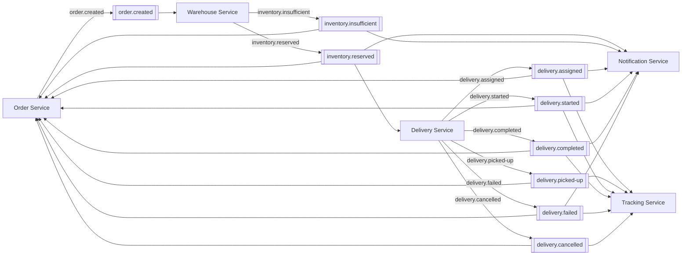

# FleetFlow Kafka Event Contract

Every message on the bus is a JSON object with the same envelope, so a consumer can
log, route and deduplicate without knowing the payload type.

---

## 1. Envelope

```json
{
  "eventId": "5f1c…",
  "eventType": "ORDER_CREATED",
  "topic": "order.created",
  "correlationId": "9f2c1a5e-4a3b-4f77-9d21-6b0e2c8a1d34",
  "timestamp": "2026-10-02T13:53:11.204Z",
  "payload": { }
}
```

| Field | Purpose |
|---|---|
| `eventId` | UUID, generated once at publication. **The consumer idempotency key.** |
| `eventType` | Logical name, independent of the topic. |
| `topic` | Where it was published. |
| `correlationId` | The `X-Correlation-ID` of the originating HTTP request. |
| `timestamp` | When the event was created, ISO-8601 UTC. |
| `payload` | Event-specific body. |

Values on the wire are plain JSON strings. Serialisation is explicit in
`KafkaDomainEventPublisher` rather than reflective, so the bytes on the wire match this
document exactly and no trusted-package configuration is needed on either side.

Producer settings: `StringSerializer` for key and value, `acks=all`,
`enable.idempotence=true`, ten second synchronous send. Publishing is synchronous on
purpose — the producing service has already committed its own transaction, so a broker
outage must surface as a failed API response rather than a silently dropped event.

---

## 2. Topic topology



Partition counts are declared in `infrastructure/kafka/01-create-topics.sh` and in the
Kubernetes init job. Anything keyed by `orderId` gets six partitions so per-order
ordering holds under load and can be scaled up later; the low-volume administrative
topics get three.

---

## 3. Events

### `order.created` — Order → Warehouse

Published after the order row, its items and the first history row are committed.

```json
{
  "eventId": "…", "eventType": "ORDER_CREATED", "topic": "order.created",
  "correlationId": "…", "timestamp": "2026-10-02T13:53:11.204Z",
  "payload": {
    "orderId": 1024,
    "customerId": 25,
    "city": "Tunis",
    "postalCode": "1000",
    "itemCount": 3,
    "totalAmount": 128.000
  }
}
```

Carries no customer PII: the Warehouse Service only needs identifiers and the
fulfilment geography. It does not receive the order lines — those are fetched
synchronously from `GET /internal/api/orders/{orderId}/items`, because a reservation
needs per-product quantities and an event that omits them would leave the consumer
unable to act without a second round trip anyway.

### `inventory.reserved` — Warehouse → Delivery, Order, Notification

```json
{
  "payload": {
    "orderId": 1024,
    "customerId": 25,
    "warehouseId": 1,
    "warehouseName": "Tunis Centre Warehouse",
    "reservedValue": 120.000,
    "itemCount": 3
  }
}
```

Effects: Order `CREATED → CONFIRMED`. Delivery Service creates one delivery per order
with status `CREATED`. Notification tells the customer the items are reserved.

### `inventory.insufficient` — Warehouse → Order, Notification

```json
{
  "payload": {
    "orderId": 1024,
    "customerId": 25,
    "shortfalls": [
      { "productId": 15, "productName": "Wireless Mouse", "requested": 2, "available": 1 }
    ]
  }
}
```

Every shortfall is reported, not just the first, so the customer learns about the whole
problem at once. The Order Service cancels the order; nothing was reserved.

### `delivery.assigned` — Delivery → Order, Notification, Tracking

```json
{
  "payload": {
    "deliveryId": 845,
    "orderId": 1024,
    "customerId": 25,
    "driverId": 3,
    "driverUserId": 5,
    "driverName": "Ahmed Ben Ali",
    "vehicleId": 2,
    "vehicleRegistration": "123 تونس 4567"
  }
}
```

> `driverId` and `driverUserId` are **not** interchangeable. `driverId` is the Delivery
> Service's own primary key. `driverUserId` is the platform identity (the JWT subject).
> Any authorisation check must compare against `driverUserId`. Conflating them was a
> real integration bug; both services now have tests pinning the distinction.

### `delivery.picked-up`, `delivery.started`, `delivery.failed`, `delivery.cancelled`

One shared body, four topics. Only the topic and `newStatus` differ, which keeps the
consumer code identical across the lifecycle.

```json
{
  "payload": {
    "deliveryId": 845,
    "orderId": 1024,
    "customerId": 25,
    "driverId": 3,
    "driverUserId": 5,
    "previousStatus": "PICKED_UP",
    "newStatus": "IN_TRANSIT",
    "reason": null
  }
}
```

`reason` carries the failure or cancellation text for `delivery.failed` and
`delivery.cancelled`, and is `null` otherwise.

### `delivery.completed` — Delivery → Order, Notification, Tracking

```json
{
  "payload": {
    "deliveryId": 845,
    "orderId": 1024,
    "customerId": 25,
    "driverId": 3,
    "driverUserId": 5,
    "completedAt": "2026-10-02T14:31:07.512Z",
    "proofOfDelivery": "Handed to concierge"
  }
}
```

This is the event that moves the order to `DELIVERED` and produces the customer
notification. It also frees the driver and the vehicle back to `AVAILABLE`.

---

## 4. Consumer obligations

Every consumer must satisfy three rules.

**1. Restore the correlation id.** The handler body runs inside
`CorrelationIdScope.open(envelope.correlationId())`, so log lines and any republished
events keep pointing at the originating request.

**2. Be idempotent.** Wrap the handler:

```java
idempotencyService.executeOnce(envelope.eventId(), envelope.eventType(), () -> handle(envelope));
```

`IdempotencyService` records the `eventId` with `INSERT … ON CONFLICT DO NOTHING` — one
atomic statement, no distributed lock. A handler that throws is *not* recorded, so Kafka
redelivers it; a handler that succeeds is skipped on every later delivery of the same
event.

The tracking service is the documented exception: its consumers are upserts keyed on
the delivery, so a replay is naturally idempotent and the extra write would only cost a
database round trip per event.

**3. Tolerate an unknown field.** Payloads are records in `fleetflow-common`. Jackson is
configured to ignore unknown properties, so adding a field to a payload does not break a
consumer that has not been redeployed. Removing or renaming one does — which is why the
contract lives in shared code rather than in a schema registry nobody enforces.

---

## 5. Naming rules

| | Rule | Example |
|---|---|---|
| Topic | `<aggregate>.<past-tense-verb>`, lowercase, dotted | `inventory.reserved` |
| `eventType` | `<AGGREGATE>_<PAST_TENSE>`, uppercase, underscore | `INVENTORY_RESERVED` |
| Payload record | `<Aggregate><PastTense>Payload` | `InventoryReservedPayload` |

Topic names are never hard-coded in a service. They arrive through
`fleetflow.kafka.topics.*` in each service's `application.yml`, so an environment can
rename a topic without a rebuild.